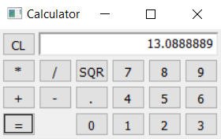

# bindbc-cocoa

- A dynamic D binding to cocoa, which are compatible with @nogc, nothrow, and BetterC (WIP).
- This is based on dplug:macos derelict-cocoa
- The Example calculator app works on Windows (via GNUstep) and Macos.
- Some basic controls are available at the moment (NSWindow, NSButton, and NSTextField).

- Simple Hello World
```d
import std.stdio;

import bindbc.cocoa;

void main(){
    
    // with GNUstep on Windows
    // set PATH=%PATH%;d:\GNUstep\x64\Release\bin
    //auto _rt = loadRT("D:/developer_tools/GNUstep/x64/Release/bin/objc.dll"); writeln(_rt);
    //auto _fo = loadFoundation("D:/developer_tools/GNUstep/x64/Release/bin/gnustep-base-1_28.dll"); writeln(_fo);

    // with Apple's cocoa on Windows (needs itunes :) )
    // auto _rt = loadRT("C:/Program Files/iTunes/objc.dll"); writeln(_rt);
    // auto _fo = loadFoundation("C:/Program Files/iTunes/Foundation.dll"); writeln(_fo);

    // on MacOS
    //auto _rt = loadRT("/System/Library/Frameworks/Cocoa.framework/Cocoa"); writeln(_rt);
    //auto _fo = loadFoundation("/System/Library/Frameworks/Cocoa.framework/Cocoa"); writeln(_fo);

    NSLog(NSString.stringWith("Hello from Cocoa, here is some number: %d\n"w)._id, 3);
}
```


- Simple Gui 
```d
module app;

import std.stdio;

import bindbc.cocoa;

import calcface;
import calcbrain;

void main(string[] args){
    // with Apple's cocoa
    /+
    auto _rt = loadRT("/System/Library/Frameworks/Cocoa.framework/Cocoa"); writeln(_rt);
    auto _fo = loadFoundation("/System/Library/Frameworks/Cocoa.framework/Cocoa"); writeln(_fo);
    auto _ak = loadAppkit("/System/Library/Frameworks/Cocoa.framework/Cocoa"); writeln(_ak);
    +/
    // with GNUstep
    auto _rt = loadRT("D:/GNUstep/x64/Release/bin/objc.dll"); writeln(_rt);
    auto _fo = loadFoundation("D:/GNUstep/x64/Release/bin/gnustep-base-1_29.dll"); writeln(_fo); 
    auto _ak = loadAppkit("D:/GNUstep/x64/Release/bin/gnustep-gui-0.dll"); writeln(_ak);

    NSApplication app = NSApplication.sharedApplication();
    
    CalcFace win; win.parent = CalcFace.alloc(); // source/calcface.d
    
    NSRect rect = NSRect(NSPoint(100.0, 100.0), NSSize(225.0, 111.0));

    win.initWithContentRect(rect, 
        NSTitledWindowMask | NSMiniaturizableWindowMask | NSClosableWindowMask | NSResizableWindowMask, 
        NSBackingStoreBuffered, NO);
    win.build();
    
    win.setIsVisible(YES);

    app.setDelegate(win._id);
    app.run();
}
```